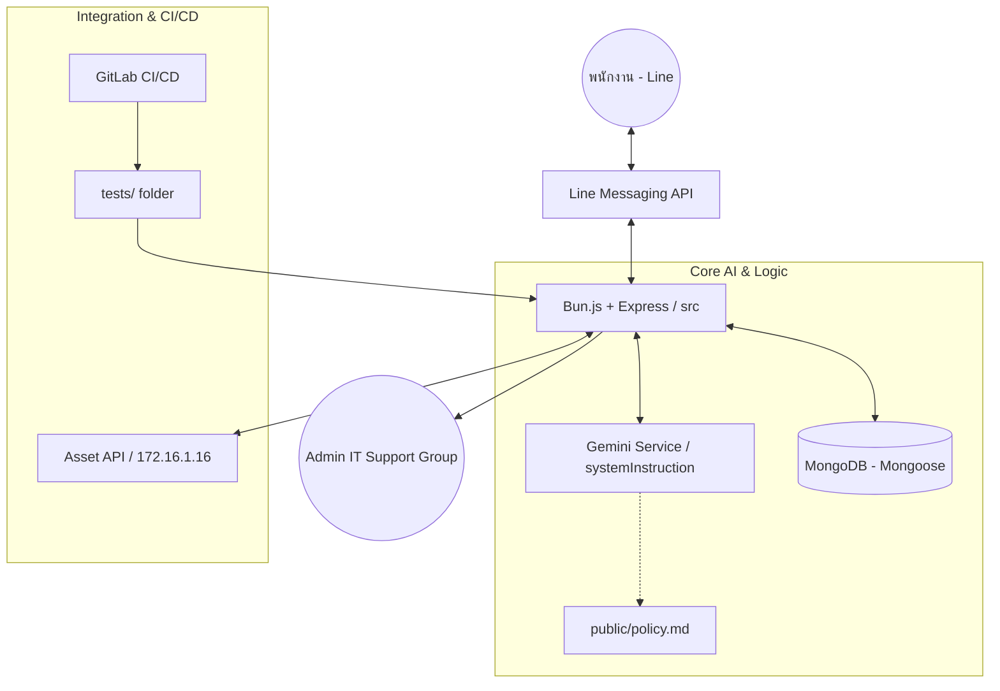

# 🤖 System Architecture: Jastel IT Support Line Bot (AI-Powered)

## 📋 Table of Contents
- [Project Overview](#project-overview)
- [Key Features](#key-features)
- [System Components](#system-components)
- [AI Intelligence & Policy Learning](#ai-intelligence--policy-learning)
- [Data Model & Flow](#data-model--flow)
- [CI/CD & Quality Assurance](#cicd--quality-assurance)
- [Technology Stack](#technology-stack)

---

## 🔍 Project Overview
**Jastel IT Support Line Bot** คือระบบผู้ช่วยอัจฉริยะ (AI Assistant) บนแพลตฟอร์ม LINE ที่ออกแบบมาเพื่อยกระดับงานบริการ IT Support ภายในองค์กร โดยใช้ขุมพลังจาก **Google Gemini AI** ในการวิเคราะห์ปัญหาและให้คำแนะนำเบื้องต้นแก่พนักงานแบบ Self-Service พร้อมระบบเชื่อมต่อฐานข้อมูลอุปกรณ์ (Asset Management) เพื่อตรวจสอบสถานะประกันและแจ้งเตือนไปยังทีม Admin โดยอัตโนมัติ

---

## ✨ Key Features
โปรเจคนี้ประกอบด้วยความสามารถหลัก ดังนี้:

### 1. **AI Problem Diagnosis & Troubleshooting** 🧠
- วิเคราะห์ปัญหาด้วยภาษาธรรมชาติ (Natural Language)
- **Policy-Aware AI**: AI มีความรู้ความเข้าใจในนโยบายความปลอดภัยสารสนเทศของบริษัท (P-02) และตอบคำถามตามกฎระเบียบอย่างเคร่งครัด
- คัดกรองปัญหา IT (IT Related Filter) และให้คำแนะนำแบบขั้นตอน (Step-by-step Advice)

### 2. **Smart Asset & Warranty Tracking** 💻
- ดึงข้อมูลอุปกรณ์จากระบบ (Asset Search API) ด้วยชื่อหรือรหัสพนักงาน
- แสดงรายการอุปกรณ์พร้อมข้อมูล **S/N และสถานะประกันคงเหลือ**

### 3. **Automated Ticket Escalation** 🎫
- สร้าง **Ticket ID (TIC-YYYYMMDD-XXX)** อัตโนมัติเมื่อแก้ปัญหาไม่ได้
- ส่งข้อความแจ้งเตือนไปยังกลุ่ม LINE Admin พร้อมข้อมูลสรุปปัญหาและพิกัดอุปกรณ์

### 4. **User Registration & Satisfaction** ⭐
- ระบบลงทะเบียนพนักงานผ่าน Bot เพื่อยืนยันตัวตน
- ระบบให้คะแนนความพึงพอใจ (Satisfaction Rating 1-5) หลังปิดเคส

---

## 🏗️ System Components

---

## 🧠 AI Intelligence & Policy Learning
ระบบมีการใช้เทคนิค **System Instruction Injection** เพื่อให้ AI มีความรู้เฉพาะทางของบริษัท:

1. **Policy Loading**: ไฟล์ `public/policy.md` จะถูกโหลดเข้าสู่ตัวแปร `COMPANY_POLICY` เมื่อเซิร์ฟเวอร์เริ่มต้น
2. **System Instruction**: นโยบายบริษัทจะถูกฉีดเข้าไปใน `systemInstruction` ของโมเดล Gemini 1.5+ ทำให้ AI ยึดถือข้อมูลนี้เป็นบรรทัดฐานสูงสุด
3. **Reference logic**: AI ถูกโปรแกรมให้ระบุข้อความอ้างอิงนโยบาย (เช่น "ตามนโยบาย P-02...") เมื่อตอบคำถามเรื่องความปลอดภัย

---

## 📊 Data Model & Flow

### 1. Database Schema
- **User**: เก็บโปรไฟล์พนักงาน, Line ID, และข้อมูลการผูกบัญชี
- **Conversation**: เก็บประวัติการแชท (Messages), สถานะ (Status), การให้คะแนน (Rating), และ Ticket ID
- **Ticket**: เก็บรายละเอียดปัญหาที่ถูกส่งต่อไปยังเจ้าหน้าที่

### 2. Key Flows
- **Registration**: ยืนยันตัวตนผ่านพนักงาน ID -> ส่ง OTP (Nodemailer) -> บันทึกสถานะ
- **Chat & Learn**: User Message -> RAG (Search past tickets) + Policy Check -> AI Response
- **Resolution**: แก้ปัญหาได้ -> ให้คะแนน -> ปิดเคส | แก้ไม่ได้ -> สร้าง Ticket -> แจ้ง Admin

---

## 🛡️ CI/CD & Quality Assurance
ระบบรองรับการทำ Automated Testing เพื่อความเสถียรของบริการ:

- **Unit Tests**: ทดสอบ Logic การประมวลผลคำตอบ (Response Parsing) ของ AI
- **Operation Tests**: ตรวจสอบความพร้อมของระบบ เช่น ความมีอยู่ของไฟล์ Policy และระบบจัดการสถานะ (State Management)
- **GitLab Pipeline**: รัน `bun test` ทุกครั้งที่มีการ Push โค้ดผ่าน Docker (oven/bun) เพื่อคัดกรองก่อนส่งไปที่ Deployment Stage

---

## 🛠️ Technology Stack
- **Runtime**: [Bun.js](https://bun.sh/) (High performance)
- **Framework**: Express.js (REST API & Webhook)
- **Database**: MongoDB + Mongoose (Message Persistence)
- **AI Engine**: Google Gemini 1.5 Flash (Large Language Model)
- **Testing**: Bun Test (Built-in test runner)
- **CI/CD**: GitLab CI/CD with Docker orchestration
