# 🤖 System Architecture: Jastel IT Support Line Bot (AI-Powered)

## 📋 Table of Contents
- [Project Overview](#project-overview)
- [System Architecture Diagram](#system-architecture-diagram)
- [Message Flow (Sequence Diagram)](#message-flow-sequence-diagram)
- [Conversation State Machine](#conversation-state-machine)
- [Ticket Lifecycle](#ticket-lifecycle)
- [AI Pipeline (RAG + Policy)](#ai-pipeline-rag--policy)
- [Data Model (ERD)](#data-model-erd)
- [API Endpoints](#api-endpoints)
- [Deployment & Network Topology](#deployment--network-topology)
- [Directory Structure](#directory-structure)
- [Technology Stack](#technology-stack)

---

## 🔍 Project Overview
**Jastel IT Support Line Bot** คือระบบผู้ช่วยอัจฉริยะ (AI Assistant) บนแพลตฟอร์ม LINE ที่ออกแบบมาเพื่อยกระดับงานบริการ IT Support ภายในองค์กร โดยใช้ขุมพลังจาก **Google Gemini AI** ในการวิเคราะห์ปัญหาและให้คำแนะนำเบื้องต้นแก่พนักงานแบบ Self-Service พร้อมระบบเชื่อมต่อฐานข้อมูลอุปกรณ์ (Asset Management) เพื่อตรวจสอบสถานะประกัน และระบบ Ticket Escalation แจ้งเตือนไปยังทีม Admin โดยอัตโนมัติ

---

## 🏗️ System Architecture Diagram

> ข้อมูลอ้างอิงจาก source code จริง: `app.ts`, `handlers/main.ts`, `gemini.ts`, `api.ts`

```mermaid
graph TB
    subgraph USERS["👥 ผู้ใช้งาน"]
        EMP["👤 พนักงาน (LINE App)"]
        ADMIN["🖥️ IT Admin (Web Dashboard)"]
    end

    subgraph GATEWAY["🌐 Platform and Gateway"]
        LINE_API["💬 LINE Messaging API"]
        CF["☁️ Cloudflare Tunnel (Public HTTPS)"]
    end

    subgraph SERVER["🖥️ Application Server — Bun.js + Express port 3002"]
        direction TB
        WEBHOOK["📥 POST /webhook\nHMAC-SHA256 Signature Validation\n→ 200 OK ทันที → Background Process"]
        REST["📡 REST API /api/*"]
        STATIC["📁 /uploads Static Files"]

        subgraph LINESVC["LineService → Event Router"]
            FOLLOW["FollowEvent → handleFollow"]
            MSG_HANDLER["MessageEvent\n→ handleTextMessage\n→ handleMedia / handleSticker"]
        end

        subgraph HANDLERS["Handlers Layer"]
            MAIN_H["main.ts\n• Greeting Keywords\n• Ticket Query (IT-XXXXXX)\n• Device Query via Asset API\n• ยืนยันปิดเคส / ตีกลับ\n• Rating Flow\n• Gemini AI Chat"]
            SUPPORT_H["support.ts\n• escalateToSupport()\n• สร้าง Ticket\n• analyzeIssue / clarifyIssue (AI)\n• Notify Admin Group"]
            REG_H["registration.ts\n• Employee ID / Email verify\n• OTP via Gmail SMTP\n• Create User record"]
            MEDIA_H["media.ts\n• Image → base64 → Gemini Vision\n• PDF → base64 → Gemini Vision"]
        end

        subgraph SERVICES["Core Services"]
            GEMINI_SVC["🧠 GeminiService\nModel: gemini-3.1-flash-lite-preview\nchat() Semaphore max 10\nanalyzeImage/PDF() Semaphore max 5\nRAG: searchRelatedTickets()\nRetry Backoff + 30s Timeout"]
            CONV_SVC["ConversationService\nSession Lifecycle Management\nappendUserMessage()\nappendAssistantMessage()"]
            MSG_SVC["MessagingService\nreplyText()\nreplyTextWithQuickReply()\npushMultipleMessages()\nshowLoadingAnimation()"]
            AUTO_CLOSE["⏰ ticketAutoClose Worker\nCron ทุก 1 ชม.\nAuto-close resolved > 72 ชม."]
        end

        subgraph APIHANDLERS["REST API Handlers"]
            A1["GET /api/stats\n(users, ratings, resolution time, depts)"]
            A2["GET /api/tickets\n(pagination + filter by status)"]
            A3["GET /api/issues\n(Top Issues จาก Conversations)"]
            A4["GET /api/ratings\n(คะแนน 1-5)"]
            A5["GET /api/trends\n(7 วันย้อนหลัง)"]
            A6["GET /api/activity\n(Ticket + StatusHistory Feed)"]
            A7["GET /api/users\n(pagination + search)"]
            A8["GET /api/conversations\n(pagination + filter)"]
            A9["PUT /api/tickets/:id/status\nMulter File Upload 10MB\nUpdate DB + Push LINE Notify"]
        end
    end

    subgraph AI_DB["🗄️ AI and Database"]
        GEMINI["✨ Google Gemini AI\ngemini-3.1-flash-lite-preview\nmaxTokens 800 / temp 0.3 / topP 0.85"]
        MONGO["🍃 MongoDB\ncollections: users / conversations / tickets\nText Index สำหรับ RAG"]
    end

    subgraph INTEGRATIONS["🔗 Integrations"]
        ASSET_API["📦 Asset API Internal\nhttp://172.16.1.16:3000/api\nGET /assets/search?employee_name="]
        GMAIL["📧 Gmail SMTP\nNodemailer OTP Verification"]
        ADMIN_GROUP["👥 Admin LINE Group\nenv ADMIN_GROUP_ID\nNew Ticket Alerts + Bounce Alerts"]
    end

    subgraph FRONTEND["🖥️ IT Admin Dashboard React + Vite"]
        DASH["📊 LineSupportDashboard\nfetch /line-api/stats /tickets\n/issues /ratings /trends /activity"]
        ESC["🚨 EscalatedIssues\nfetch /line-api/tickets\nPUT status + file upload\nPolling ทุก 10 วินาที"]
        USERS_P["👤 Users Page\nfetch /line-api/users"]
        CONV_P["💬 UserConversations\nfetch /line-api/conversations"]
    end

    EMP -->|"ส่งข้อความ / รูป / ไฟล์ / Sticker"| LINE_API
    LINE_API -->|"POST /webhook"| CF
    CF -->|"HTTPS to HTTP tunnel"| WEBHOOK
    WEBHOOK --> LINESVC
    FOLLOW --> REG_H
    MSG_HANDLER --> MAIN_H
    MSG_HANDLER --> SUPPORT_H
    MSG_HANDLER --> MEDIA_H
    MAIN_H --> GEMINI_SVC
    MAIN_H --> CONV_SVC
    SUPPORT_H --> CONV_SVC
    SUPPORT_H --> GEMINI_SVC
    MEDIA_H --> GEMINI_SVC
    REG_H --> GMAIL
    REG_H --> CONV_SVC
    GEMINI_SVC <-->|"generateContent() / startChat()"| GEMINI
    GEMINI_SVC -->|"RAG Text Search resolved tickets"| MONGO
    CONV_SVC <--> MONGO
    MAIN_H <-->|"Ticket.findOne() / ticket.save()"| MONGO
    SUPPORT_H -->|"new Ticket().save()"| MONGO
    AUTO_CLOSE <--> MONGO
    MAIN_H -->|"Device Query /assets/search?employee_name="| ASSET_API
    MSG_SVC -->|"replyMessage() / pushMessage()"| LINE_API
    LINE_API --> EMP
    MSG_SVC -->|"pushMessage(adminGroupId)"| ADMIN_GROUP
    REST --> APIHANDLERS
    A1 <--> MONGO
    A2 <--> MONGO
    A3 <--> MONGO
    A4 <--> MONGO
    A5 <--> MONGO
    A6 <--> MONGO
    A7 <--> MONGO
    A8 <--> MONGO
    A9 <--> MONGO
    A9 -->|"Push Status + Files"| MSG_SVC
    A9 --> STATIC
    ADMIN --> FRONTEND
    DASH -->|"Vite proxy /line-api → port 3002"| REST
    ESC --> REST
    USERS_P --> REST
    CONV_P --> REST

    style USERS fill:#e0f2fe,stroke:#0284c7,color:#0c4a6e
    style GATEWAY fill:#fef3c7,stroke:#d97706,color:#78350f
    style SERVER fill:#f0fdf4,stroke:#16a34a,color:#14532d
    style AI_DB fill:#fdf4ff,stroke:#a21caf,color:#581c87
    style INTEGRATIONS fill:#fff7ed,stroke:#ea580c,color:#7c2d12
    style FRONTEND fill:#eff6ff,stroke:#2563eb,color:#1e3a8a
    style LINESVC fill:#dcfce7,stroke:#15803d,color:#14532d
    style HANDLERS fill:#d1fae5,stroke:#059669,color:#065f46
    style SERVICES fill:#bbf7d0,stroke:#16a34a,color:#14532d
    style APIHANDLERS fill:#dbeafe,stroke:#2563eb,color:#1e3a8a
```

---

## 📨 Message Flow (Sequence Diagram)

### กรณีที่ 1: ผู้ใช้ถามปัญหา IT → AI ตอบ

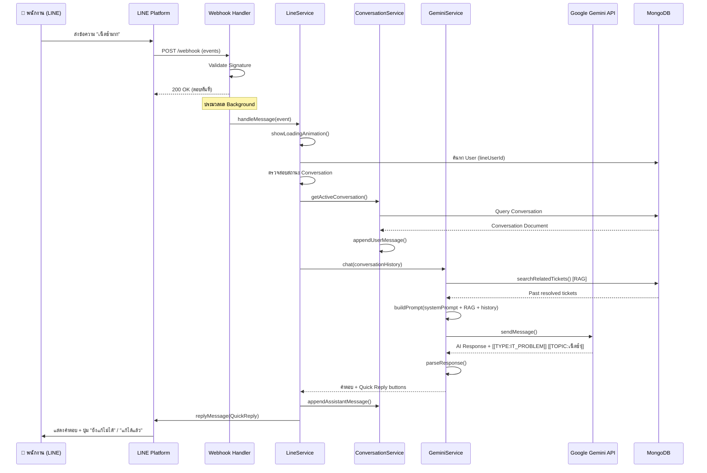

### กรณีที่ 2: ผู้ใช้กด "ยังแก้ไม่ได้" → Escalate สร้าง Ticket

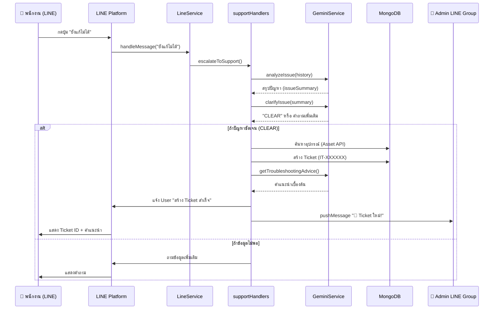

### กรณีที่ 3: Admin อัปเดตสถานะ → แจ้ง User ผ่าน LINE

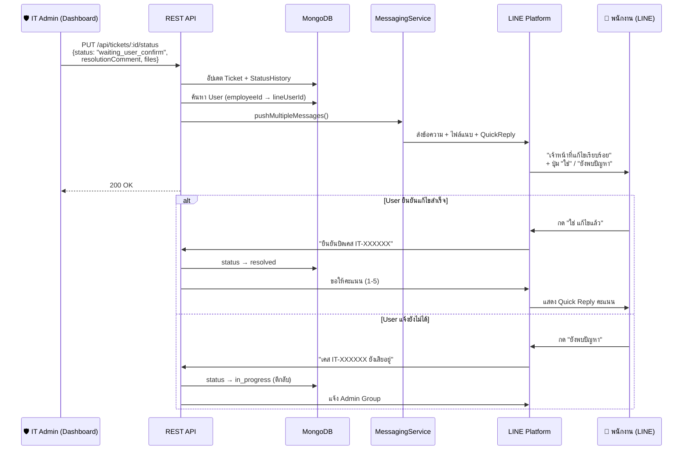

---

## 🔄 Conversation State Machine

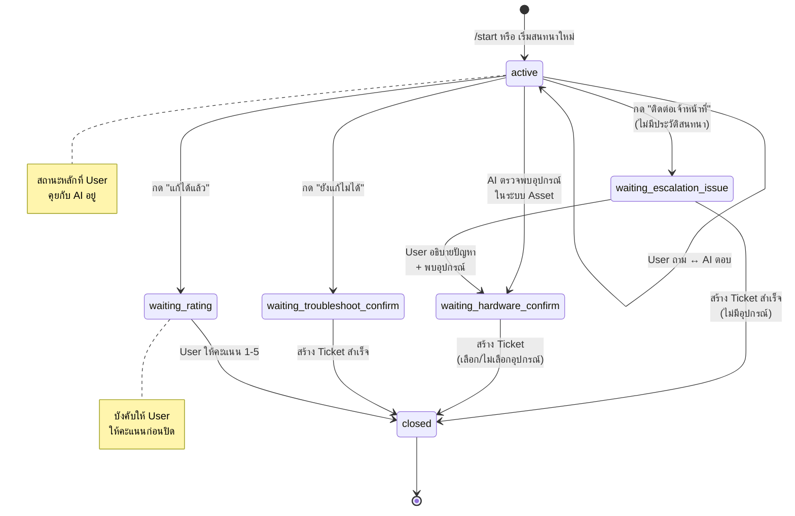

---

## 🎫 Ticket Lifecycle

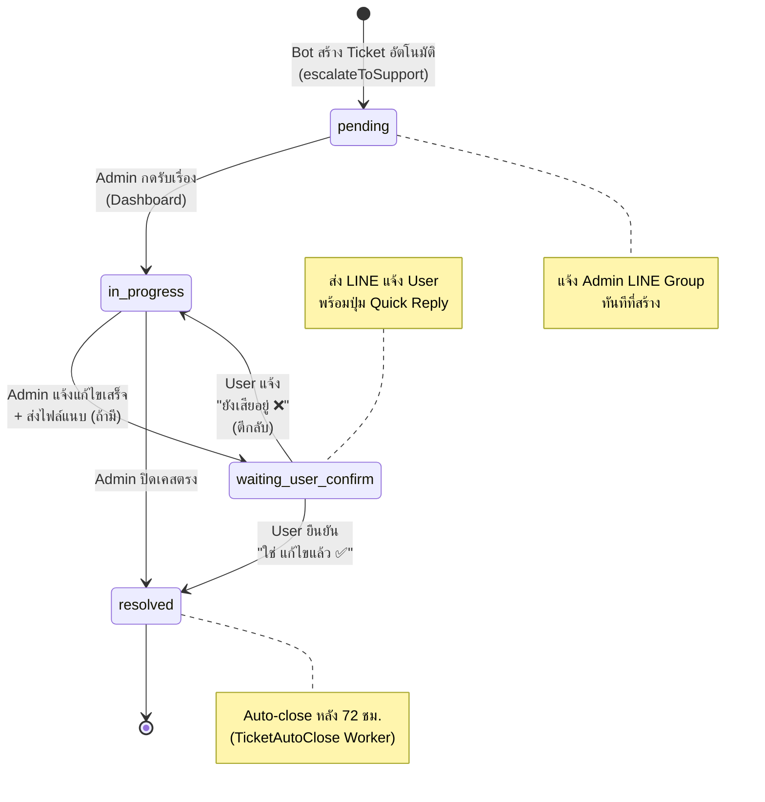

---

## 🧠 AI Pipeline (RAG + Policy)

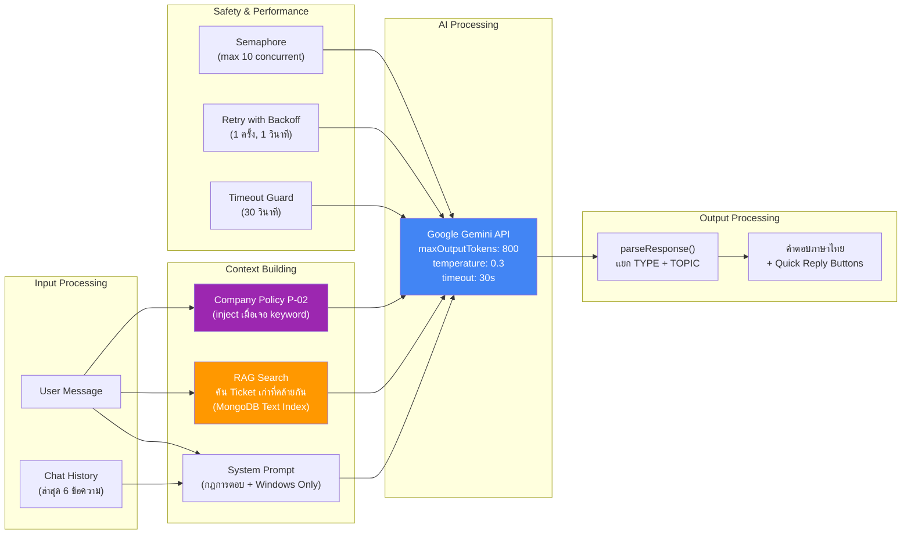

---

## 📊 Data Model (ERD)

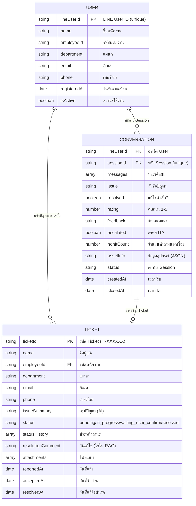

---

## 🌐 API Endpoints

| Method | Endpoint | Description |
|--------|----------|-------------|
| `POST` | `/webhook` | LINE Webhook (รับ Events จาก LINE Platform) |
| `GET` | `/api/stats` | สถิติรวม (Users, Conversations, Rating, Resolution Time) |
| `GET` | `/api/conversations` | รายการ Conversations + Pagination + Filter |
| `GET` | `/api/tickets` | รายการ Tickets + Pagination + Filter by Status |
| `GET` | `/api/issues` | Top Issues (ปัญหาที่แจ้งบ่อย) |
| `GET` | `/api/ratings` | การกระจายคะแนน 1-5 |
| `GET` | `/api/trends` | แนวโน้มเคส 7 วันย้อนหลัง |
| `GET` | `/api/activity` | Activity Feed ล่าสุด |
| `GET` | `/api/users` | รายชื่อผู้ใช้ + Search + Pagination |
| `PUT` | `/api/tickets/:id/status` | อัปเดตสถานะ + ส่ง LINE แจ้งเตือน + File Upload |

---

## 🚀 Deployment & Network Topology

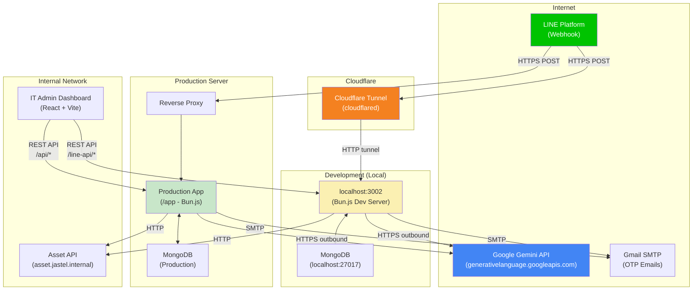

### Network Flow สำคัญ:
- **ขาเข้า (Inbound)**: `LINE → Cloudflare Tunnel → localhost:3002` (Dev) หรือ `LINE → Nginx → App` (Prod)
- **ขาออก (Outbound)**: `App → Google Gemini API` ⚠️ *Timeout 30s เกิดตรงนี้ ไม่เกี่ยวกับ Cloudflare*
- **Internal**: `App → Asset API` (เครือข่ายภายในองค์กร)

---

## 📁 Directory Structure

```
line-it-support-bot/
├── src/
│   ├── app.ts                    # Entry point (Express + Webhook + Server)
│   ├── config/
│   │   └── mongodb.ts            # MongoDB connection
│   ├── models/
│   │   ├── User.ts               # พนักงาน (LINE ID ↔ Employee)
│   │   ├── Conversation.ts       # ประวัติแชท + สถานะ Session
│   │   └── Ticket.ts             # เคสที่ส่งต่อ IT
│   ├── routes/
│   │   └── api.ts                # REST API (Dashboard ↔ Backend)
│   ├── services/
│   │   ├── gemini.ts             # 🧠 AI Service (Chat, Image, PDF, RAG)
│   │   ├── line.ts               # LINE Message Router
│   │   ├── ticketAutoClose.ts    # ⏰ Background Worker (Auto-close)
│   │   └── line/
│   │       ├── client.ts         # LINE SDK Client
│   │       ├── constants.ts      # Keywords, Config
│   │       ├── conversation.ts   # Session Management
│   │       ├── messaging.ts      # Reply / Push / QuickReply
│   │       ├── registration.ts   # OTP + Employee Verification
│   │       ├── types.ts          # TypeScript Interfaces
│   │       ├── utils.ts          # Helper Functions
│   │       └── handlers/
│   │           ├── main.ts       # Text Message Handler (หัวใจ)
│   │           ├── media.ts      # Image + PDF Handler
│   │           ├── registration.ts # OTP Flow Handler
│   │           └── support.ts    # Escalation + Rating Handler
│   └── utils/
│       ├── logger.ts             # Daily rotating log (logs/YYYY-MM-DD.log)
│       └── storage.ts            # File upload management
├── docs/
│   ├── ARCHITECTURE.md           # 📖 เอกสารนี้
│   └── QUICK_START.md            # คู่มือเริ่มต้นใช้งาน
├── logs/                         # Log files (auto-generated)
├── uploads/                      # Uploaded files (auto-generated)
├── .gitlab-ci.yml                # CI/CD Pipeline
└── package.json
```

---

## 🛠️ Technology Stack

| Layer | Technology | Purpose |
|-------|-----------|---------|
| **Runtime** | [Bun.js](https://bun.sh/) | High-performance JavaScript runtime |
| **Framework** | Express.js | REST API + Webhook handling |
| **AI Engine** | Google Gemini 3.1 Flash-Lite | LLM for chat, image/PDF analysis, RAG (RAG via MongoDB Text Search) |
| **Database** | MongoDB + Mongoose | Data persistence + Text search (RAG) |
| **Messaging** | LINE Messaging API | Bot communication with employees |
| **Email** | Nodemailer + Gmail SMTP | OTP verification during registration |
| **File Storage** | Multer + Local Disk | Ticket file attachments |
| **Tunnel** | Cloudflare Tunnel | Expose local dev to LINE webhooks |
| **CI/CD** | GitLab CI/CD + Docker | Automated testing + deployment |
| **Frontend** | React + Vite + TailwindCSS | IT Admin Dashboard |
| **Testing** | Bun Test | Built-in test runner |

---

## 🧩 System Components

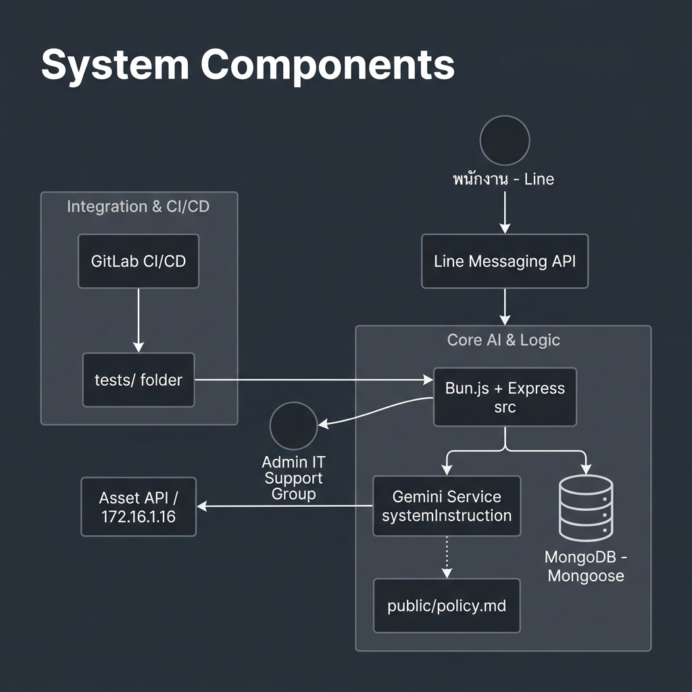

### Context Graph (Interaction Flow)

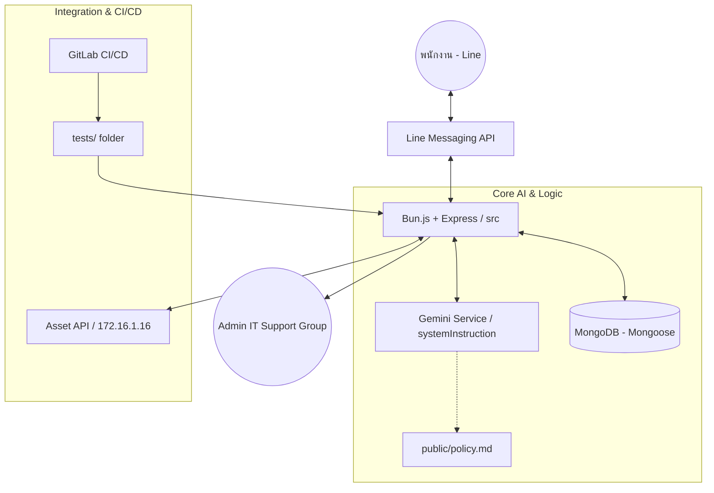
